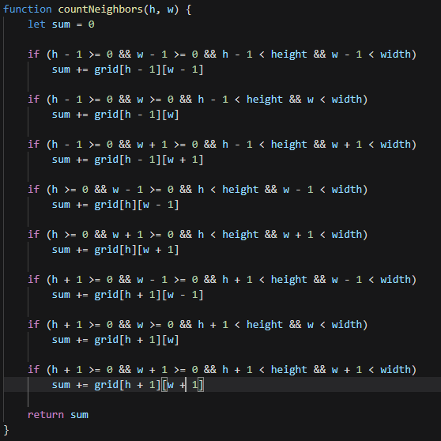

# GameOfLive

## Temat: Projekt Gra w życie.

1. Wygląd aplikacji: 

### Główny kod odpowiadający za tworzenie kolejnej generacji.

* funkcja generation() jest uruchamiana co 0.5s. 

* funkcja create2dArray(rows, cols) tworzy tablicę 2D [rows,cols], domyślnie wypełnioną wartością 0 ( wartość 0 przedstawiana jest na planszy jako pole czarne/nieżywe, natomiast wartość 1, to pole które jest koloru szarego/żywe)

* funkcja odpowiadająca za zliczanie sąsiadów.